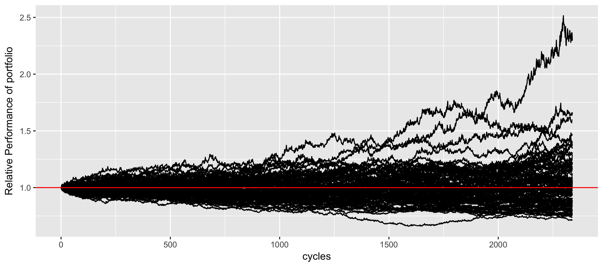

High frequency paper trading with the following strategy:
  - Buy if we have enough money
  - Sell if we're in the black
  - Alternatively sell if we've been holding for too long

Here are 100 simulations for the price for acting on the price of an option every
10 seconds, for the entire time the market is open. These are scaled against the
value of the starting portfolio. As you can tell, it's very difficult to
reliably beat "the market", as we only ever end up positive 50% of the time,
which is a net gain of $0.

Because this strategy is run against a different market everytime, we can also
attempt to model the strategy against the value of the option itself:

Here we see that we usually can't beat the market ("surprise"), and
occassionally luck out, but even then we only out-perform the market by 2.5x. 
