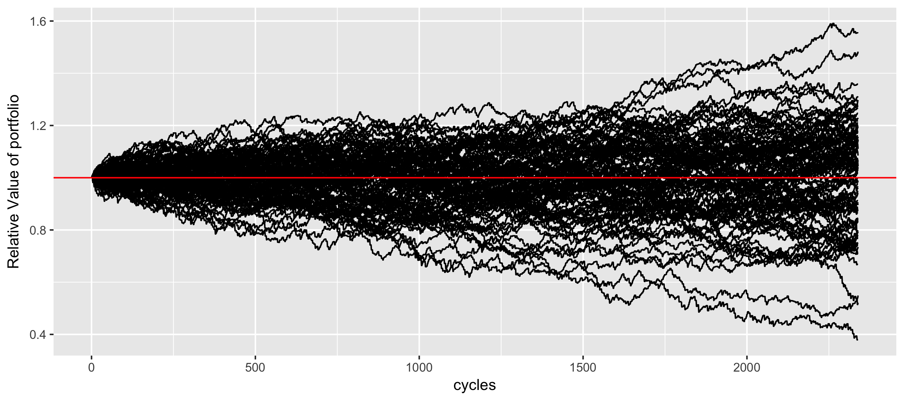

# dwight

High frequency paper trading with the following strategy:
  - Buy if we have enough money
  - Sell if we're in the black
  - Alternatively sell if we've been holding for too long

Here's a simulation for 100,000 cycles of completely random change.

